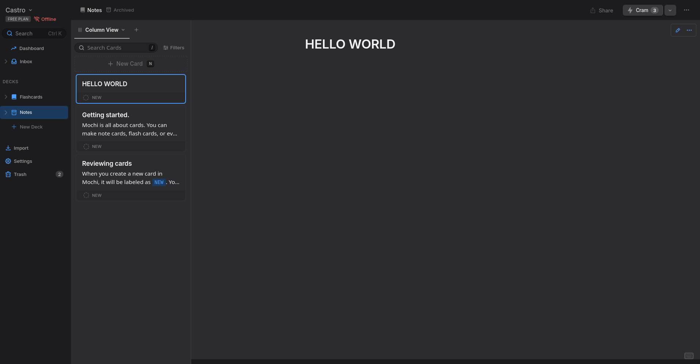

# Things-3-Mochi-Theme
A theme inspired by Things 3 for [Mochi](https://mochi.cards/)

# How to Install
1. From the Mochi app, go in the Appearance tab in the settings.
2. There's a Custom CSS Theme section at the bottom, click Add theme and select the css file with the theme and language titles you want to use
# Preview

